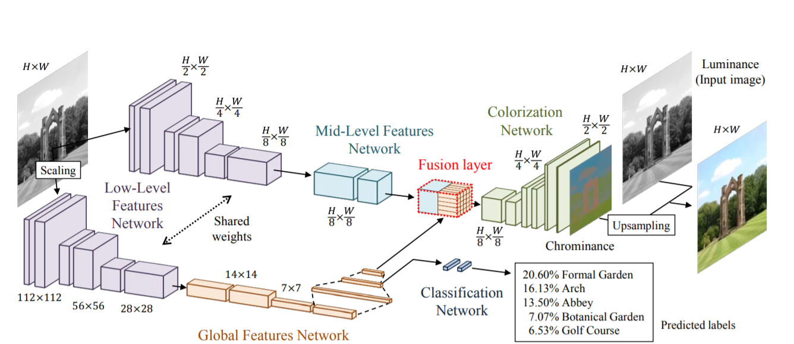
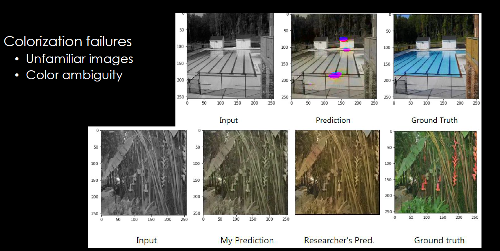

# Automatic Image Colorization
Deep learning project - Automatic Image Colorization with Classifier (global prior)  
*Demo link is only available for iit accounts*  

The project follows the methodology of this [paper](http://iizuka.cs.tsukuba.ac.jp/projects/colorization/data/colorization_sig2016.pdf).  
Building the following model in keras instead of pytorch and experimenting with a smaller dataset (due to time restrictions).  
  

I then tested on various test images within the same classes (e.g. swimming pool, bamboo forest). The unstable results were most likely caused by the small training set - the model fails to color images it does not recognize. Another challenge is color ambiguity where unsual colors (artificial materials, vibrant flowers) are hard to determine from grayscale, even with the researcher's thoroughly trained model.  

